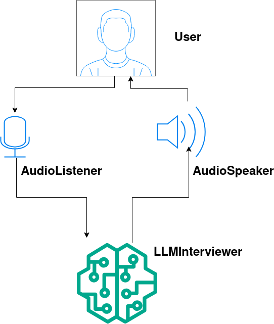

# LLM_interviewer 
---
## 프로젝트 소개
---

Openvino와 Qwen2.5 LLM모델을 바탕으로 
사용자의 대답을 듣고 질문하며 모의 면접을 진행해주는 프로그램

## 팀원 소개
---
| 김주원 | 이건희 | 김민성 | 황산하 | 

## 개발 동기
---
현 Intel SESAC 프로그램을 진행하면서 지원하고 또 면접까지 가는 사람들이 있었는데

면접을 연습하는 과정에서 상호작용하는 말하기 연습이 제일 어려워 보였다.

대상자 없이 혼자서 말하는 연습은 하기 쉽지만 

상호작용할 대상 앞에서 말할 연습의 기회가 적어 어려움을 겪는 교육생을 보았다.

그래서 면접이 어렵고 연습할 기회가 없는 사람들에게 도움이 되고자 이 프로그램을 개발하게 되었다. 

## 프로그램 구조 
---
프로그램은 전반적으로 세 단계로 이루어져 있다. 

1. 사용자의 발화를 듣고 텍스트로 변환

2. 변환된 텍스트를 LLM이 입력받고 응답을 생성

3. 생성된 응답을 다시 컴퓨터 스피커로 발화

각각의 기능들을 분리해서 하나의 클래스로 만들었다. 

- 1.기능 -> AudioListener class
- 2.기능 -> LLMInterviewer class
- 3.기능 -> AudioSpeaker class 

이것을 구조화  해서 살펴보면 다음과 같다. 

## 기술 스택
---

